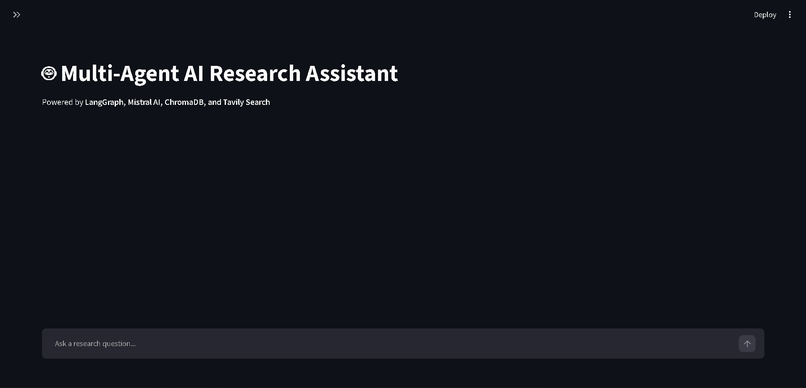
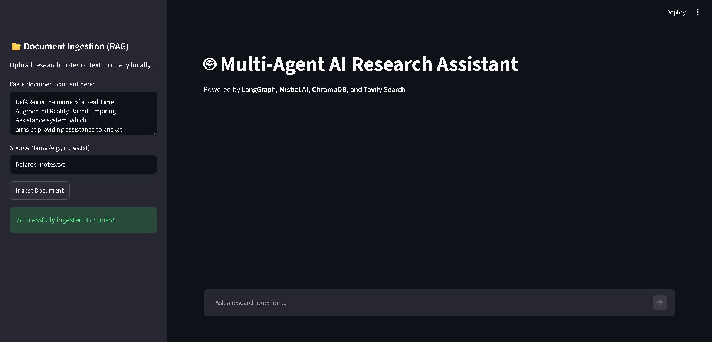
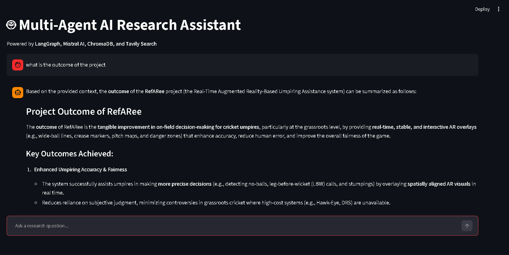

<div align="center">

# 🤖 Multi-Agent AI Research Assistant

### AI-powered Research Assistant using LangGraph, Mistral AI, ChromaDB, FastAPI & Streamlit


A **Multi-Agent AI Research Assistant** that combines **Retrieval-Augmented Generation (RAG)**, **live web search**, and **multi-agent orchestration** to generate comprehensive, citation-backed research responses.

</div>

---

# ✨ Features

- 🤖 Multi-Agent workflow powered by **LangGraph**
- 📚 Retrieval-Augmented Generation (RAG)
- 📝 Local document ingestion
- 🔎 Semantic search using ChromaDB
- 🌍 Live web search via Tavily Search API
- 💬 Multi-turn conversational interface
- 📖 Citation-backed research responses
- ⚡ FastAPI backend
- 🎨 Modern Streamlit frontend
- 🧠 Powered by Mistral AI

---

# 📸 Screenshots

## Home Screen

<p align="center">

</p>

---

## Document Ingestion (RAG)

<p align="center">

</p>

---

## Research Response

<p align="center">

</p>

---

# 🏗 Architecture

```
                    User
                      │
                      ▼
             Streamlit Frontend
                      │
                      ▼
                FastAPI Backend
                      │
            LangGraph Orchestrator
                      │
      ┌───────────────┼────────────────┐
      │               │                │
      ▼               ▼                ▼
 Planner Agent   RAG Agent      Web Search Agent
      │               │                │
      │         ChromaDB          Tavily Search
      │
      └───────────────┬────────────────┘
                      ▼
                 Writer Agent
                      │
                      ▼
             Final Research Answer
```

---

# 🛠 Tech Stack

| Category | Technologies |
|-----------|--------------|
| Language | Python |
| LLM | Mistral AI |
| Agent Framework | LangGraph |
| Vector Database | ChromaDB |
| Backend | FastAPI |
| Frontend | Streamlit |
| Web Search | Tavily Search API |
| Embeddings | Mistral Embeddings |
| Environment | python-dotenv |

---

# 📂 Project Structure

```text
Multi-Agent-Research-Assistant/
│
├── backend/
│   ├── __init__.py
│   ├── agents.py
│   ├── main.py
│   ├── rag.py
│   └── ...
│
├── frontend/
│   └── app.py
│
├── assets/
│   ├── home.png
│   ├── ingestion.png
│   └── research.png
│
├── requirements.txt
├── .env
├── .gitignore
└── README.md
```

---

# 🚀 Installation

## 1. Clone Repository

```bash
git clone https://github.com/AryanThorat80/Multi-Agent-Research-Assistant.git

cd Multi-Agent-Research-Assistant
```

---

## 2. Create Virtual Environment

### Using uv (Recommended)

```bash
uv venv
```

### Activate

Windows

```bash
.venv\Scripts\activate
```

Linux/macOS

```bash
source .venv/bin/activate
```

---

## 3. Install Dependencies

Using uv

```bash
uv pip install -r requirements.txt
```

or

```bash
pip install -r requirements.txt
```

---

# 🔑 Environment Variables

Create a `.env` file in the project root.

```env
MISTRAL_API_KEY=your_mistral_api_key

TAVILY_API_KEY=your_tavily_api_key
```

> **Note:**  
> The `.env` file is intentionally excluded from GitHub for security reasons.

---

# ▶ Running the Application

Open **two terminals**.

## Terminal 1

Start the FastAPI backend.

```bash
uvicorn backend.main:app --reload --port 8000
```

---

## Terminal 2

Start the Streamlit frontend.

```bash
streamlit run frontend/app.py
```

Your application will automatically open in the browser.

---

# 📚 How It Works

### Step 1

Paste research notes or documents into the **Document Ingestion** panel.

### Step 2

Click **Ingest Document**.

The document is

- Chunked
- Embedded
- Stored in ChromaDB

---

### Step 3

Ask any research question.

Example:

```
What is the outcome of the RefARee project?
```

---

### Step 4

The LangGraph workflow executes:

```
Planner
     ↓
Retrieve Local Knowledge (RAG)
     ↓
Live Web Search
     ↓
Merge Context
     ↓
Generate Final Response
```

---

### Step 5

Receive a detailed response containing

- Relevant information
- Citations
- Structured explanations

---

# 💡 Example Questions

```
Summarize this document.

What are the key findings?

Compare these two approaches.

Explain the methodology.

Generate a literature review.

What is the outcome of the project?
```

---

# 🌟 Highlights

✅ Multi-Agent Architecture

✅ Retrieval-Augmented Generation

✅ Live Internet Search

✅ Citation-backed Responses

✅ Semantic Search

✅ FastAPI REST Backend

✅ Streamlit UI

✅ Mistral AI Integration

---

# 🔮 Future Improvements

- PDF Upload Support
- DOCX Parsing
- Redis Chat Memory
- Authentication
- Multiple Document Collections
- Research Report Export (PDF)
- Markdown Export
- Streaming Responses
- Docker Deployment
- Cloud Deployment

---

# 👨‍💻 Author

## Aryan Thorat

Computer Engineering Graduate

### GitHub

https://github.com/AryanThorat80

### LinkedIn

https://www.linkedin.com/in/aryanthorat80/

---

<div align="center">

### ⭐ If you found this project useful, consider giving it a star!

Built with ❤️ using **LangGraph**, **Mistral AI**, **FastAPI**, **Streamlit**, **ChromaDB**, and **Tavily Search**.

</div>
